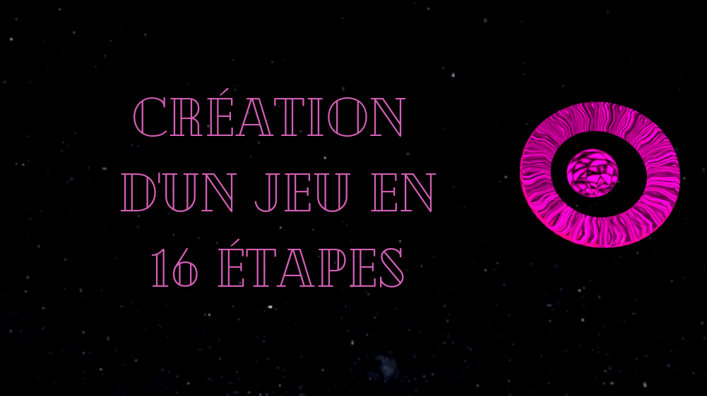

# PROJET - Moteur de jeu
## Réalisé par GERARDIN Dorian, GERMAIN Gauthier, STEFANOVA Albena

### Execution du projet 
- Télécharger le dossier Game_engine.zip et à la racine du dossier, ouvrez un terminal
Exécuter les commandes :

```bash
mkdir build
cd build
cmake ..
make -j
./launch-equilibrium.sh
```

- Voici une vidéo vous permettant de prendre en main le moteur et qui explique ses fonctionnalités

[](https://www.youtube.com/watch?v=XBmK8kLA0Nc)
